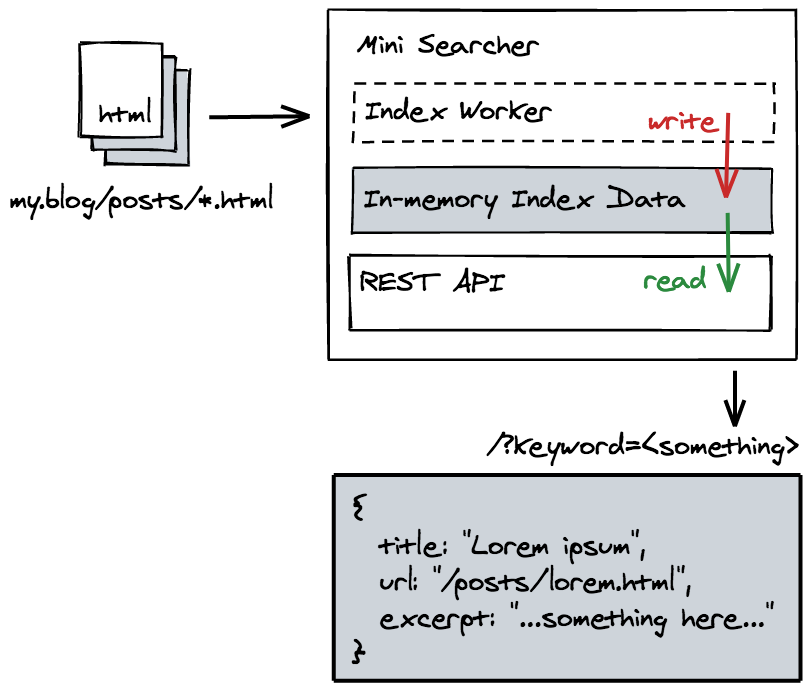

# The Mini Site Searcher

The Mini Site Searcher is a simple site indexer and search engine, which will automatically crawl and cache the content of your website and provide a search functionality via a REST API.

It can be use to provide the search functionality for static site blogs, or to build a searchable personal knowledge base,...

## How to use

First, you need to create a `.env` file, to describe how you want to setup the crawler.

For example, the with the following config, we want to setup an indexer for a website at `https://my.blog`, the crawler will start looking at `https://my.blog/index.html` page, and find all the link that has `/posts` in its URL, hence, the CSS selector for it should be `a[href*=/posts]`. And when following each of the link, the crawler will get the text content of any `<article class="main-content">` tags.

```
BASE_URL="https://my.blog"
ENTRY_POINT="https://my.blog/index.html"
LINK_SEARCH_PATTERN="a[href*='/posts']"
MAIN_CONTENT_PATTERN="article.main-content"
```

Then, run the server:

```
cargo run
```

After start, the crawler will kick in and it might take a while to finish indexing, a REST API will also be served at the default port `3366`, or whatever in your `PORT` environment variable. To search, make a `GET` request like this:

```
GET /?keyword=<something>
```

## How it works?

The program has two components:



- The index worker: a worker thread that run every 1 hour (should be configurable) to scan the target site, follow all the matched link and extract their content, store them as a table in server's memory.
- The REST API: provided an API endpoint so you can use to request for get all matched content.

## To Do

- [ ] Configurable crawler interval
- [ ] Support multiple sites
- [ ] Implement a rate limiter for the crawler
- [ ] Moving away from using RwLock
